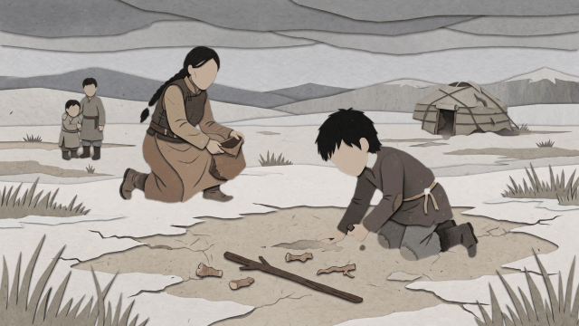

# ParallaxStudio3D

ParallaxStudio3D turns one still image into a cinematic 2.5D depth-camera move.
It was built to match the camera-through-layers technique in the supplied
reference: foreground terrain, subjects, midground objects, distant mountains,
and particles all respond to one shared camera and focal point. It is not a
collection of cut-out characters drifting sideways.

## Included demo

The supplied child-and-mother scene uses four isolated object planes, a
completed deep background, a continuous ground depth surface, a forward and
reverse camera envelope, radial motion blur, and depth-projected particles.

Generated files are in output/demo:

- child_mother_parallax.mp4 — full 1280x720 render
- child_mother_parallax.gif — lightweight looping preview
- child_mother_parallax_preview.jpg — peak camera-push frame
- layers/ — transparent PNG layers, depth map, rest composite, and manifest

## Start it

On Windows, double-click start_parallax_studio.bat.

Or run:

    python -m parallax3d app

Render the included scene from a terminal:

    python -m parallax3d render scenes\child_mother.json --output output\demo

Create a free local draft from another image:

    python -m parallax3d auto "C:\path\image.jpg" --project output\my_project
    python -m parallax3d render output\my_project\scenes\auto_scene.json --output output\my_render

## Editors

- CapCut and practically any video editor: import the generated MP4.
- After Effects: run adapters/after_effects_import.jsx and choose the generated
  layers folder.
- Blender: use adapters/blender_import.py.
- Other compositors: import the transparent PNG files and read their ordering
  and depth values from layers/manifest.json.

This universal renderer-and-manifest design is the maintainable way to support
many programs. Each host adapter stays small while the segmentation, depth,
camera, particles, and render behavior live in one core.

## Cost and quality

The included OpenCV mode is local and free. No subscription or API key is
required. Its automatic analyzer is a draft-quality fallback based on visual
saliency, GrabCut, and local inpainting.

No tool can promise perfect cutouts and hidden-background reconstruction for
every possible image. Production-quality automation needs strong segmentation,
monocular depth, and generative inpainting models, plus an editable correction
step. The included demo uses a high-quality prepared deep-background plate and
guided object mattes to show the intended quality and motion.

## Scene format

Scenes are JSON files. Important values:

- camera.focus — common normalized vanishing point
- camera.push — camera travel strength
- region.depth — 0 is far and 1 is near
- foreground_points/background_points — matte guidance
- clip_polygon — optional hard area constraint

The renderer also gives the ground a continuous depth gradient, so foreground
terrain moves differently from distant terrain instead of behaving like one
flat background card.

## Development

Install and test:

    python -m pip install -e .[dev]
    python -m pytest

The project is MIT licensed. See docs/ARCHITECTURE.md for the adapter model and
the path from this working MVP to a production AI release.
