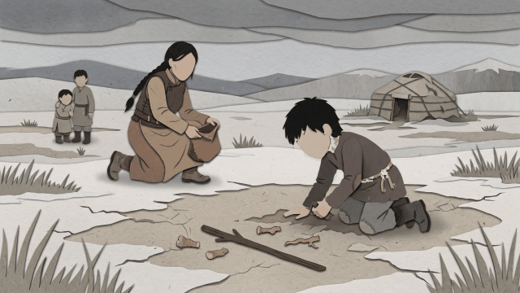

# ParallaxStudio3D

ParallaxStudio3D turns one still image into a looping cinematic 2.5D camera
move. Automatic mode uses a continuous depth surface instead of chopping a
person into hard cutout pieces, so hands, hair, and limbs remain connected to
the original image.

The motion combines:

- depth-dependent dolly movement;
- a shared side-to-side camera truck and subtle rise;
- stronger movement for near ground than distant terrain;
- independent faster sky drift with a soft horizon transition;
- depth-projected particles and restrained motion blur.

## Use it on Windows

1. Double-click start_parallax_studio.bat.
2. Browse for one JPG, PNG, or WebP under Single image.
3. Leave Scene (optional) empty for a new image.
4. Choose an output folder.
5. Click Create MP4 + GIF.

The selected output folder receives exactly:

- parallax.mp4
- parallax.gif

Depth maps and temporary analysis files are created in the Windows temporary
directory and removed automatically after rendering.

The Scene field is only for reopening an advanced hand-authored JSON scene. New
users do not need to select a scene file.

## Terminal

Render any image directly:

    python -m parallax3d image "C:\path\image.jpg" --output output\render

Render the included demo:

    render_demo.bat

Open the desktop interface:

    python -m parallax3d app

## Why automatic mode does not cut hands

The first version proposed binary subject masks with GrabCut. On difficult
illustrations this could omit a hand or wrist and make the result look like
moving stickers. The current automatic path never creates a binary person
cutout. It warps the complete source through a smooth estimated depth field,
preserving every source pixel while still giving sky, terrain, and salient
subjects different motion.

Advanced curated scenes may still provide explicit transparent object planes
and a generated clean background when a compositor needs large disocclusions.

## Editors

- Any editor, including CapCut, can import parallax.mp4.
- After Effects can use adapters/after_effects_import.jsx with an advanced
  inspected layer package.
- Blender can use adapters/blender_import.py with the same manifest.

## Cost and privacy

The included automatic renderer runs locally with OpenCV. It needs no
subscription, API key, or upload service. Normal renders leave only MP4 and GIF
in the chosen folder.

No single-image method can reveal truly hidden geometry perfectly for every
photograph. Continuous depth avoids severed body parts and is safer for
automatic use; advanced segmentation and generative inpainting remain optional
tools for shots requiring large camera travel.

## Development

Install and test:

    python -m pip install -e ".[dev]"
    python -m pytest -q

The project is MIT licensed. See docs/ARCHITECTURE.md for implementation
details.
